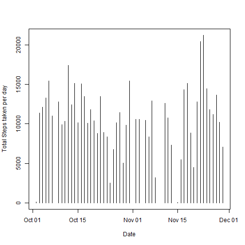
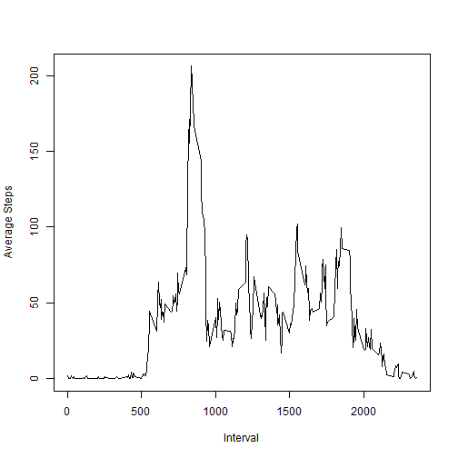
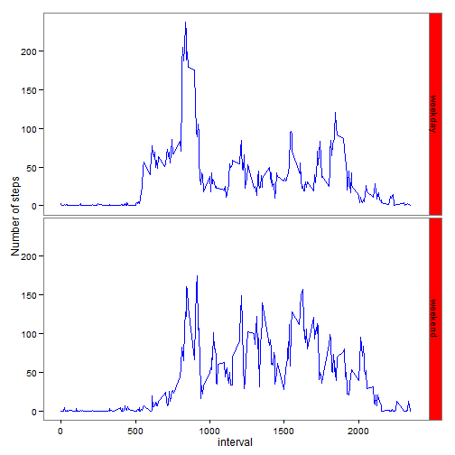

## 1. Loading and preprocessing the data


```r
activityData <- read.csv("activity.csv")
activityData <- transform(activityData, date = as.Date(date, "%Y-%m-%d"))
```

## 2. What is mean total number of steps taken per day?

```r
tidyData <- activityData[!is.na(activityData$date) & !is.na(activityData$steps),]
histData <- tapply(tidyData$steps, tidyData$date, sum)
plot(as.Date(names(histData)), histData, type = "h", xlab = "Date", ylab = "Total Steps taken per day")
```

 


## 3. What is the average daily activity pattern?

```r
meanSteps <- mean(histData)
medianSteps <- median(histData)

tidyData <- activityData[!is.na(activityData$date) & !is.na(activityData$steps),]
plotData <- tapply(tidyData$steps, tidyData$interval, mean)
plot(names(plotData), plotData, type= "l", xlab = "Interval", ylab = "Average Steps")
```

 

## 4. Imputing missing values


```r
activityData <- cbind(activityData, dayOfWeek = weekdays(activityData$date))
names(activityData)[4] <- "dayOfWeek" 

sumData <- aggregate(steps ~ weekdays(date) + interval, tidyData, mean)
names(sumData)[1] <- "dayOfWeek"
names(sumData)[3] <- "avgSteps"

NAVar <- merge(activityData, sumData, all.x = TRUE )
indxVar <- is.na(NAVar$steps)
NAVar[indxVar, 3] <- NAVar[indxVar, 5]
NAVar <- NAVar[,1:4]

tidy2Data <- NAVar[,c("steps", "date", "interval")]
```


## 5. Are there differences in activity patterns between weekdays and weekends?

```r
weekDay <- c("weekday")
NAVar <- cbind(NAVar, weekDay)
NAVar$weekDay <- as.character(NAVar$weekDay)
wkEndRows <- nrow(NAVar[(NAVar$dayOfWeek == "Sunday" | 
              NAVar$dayOfWeek == "Saturday"), ])
NAVar[(NAVar$dayOfWeek == "Sunday" | 
              NAVar$dayOfWeek == "Saturday"), 5] <- 
        rep("weekend", wkEndRows)
NAVar$weekDay <- factor(NAVar$weekDay)

library(ggplot2)

plotData2 <- aggregate(steps ~ weekDay + interval, NAVar, mean)

g <- ggplot(plotData2, aes(interval, steps))
g + 
        geom_line(col = "blue") + 
        facet_grid(weekDay ~ .) + 
        labs( y = "Number of steps") +
        theme_bw() +
        theme(panel.grid = element_blank()) +
        theme(strip.background = element_rect(fill = "red"))
```

 


